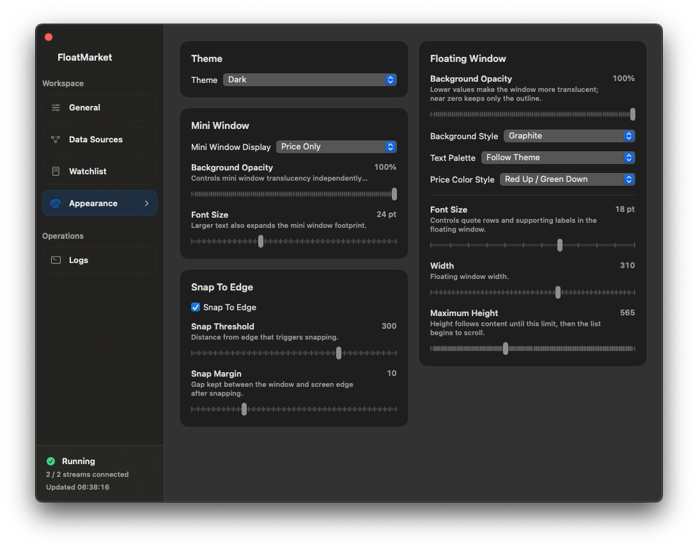
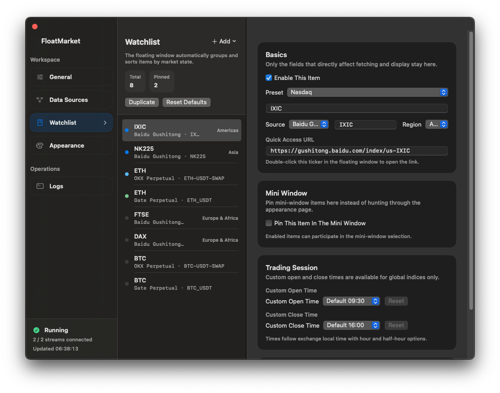
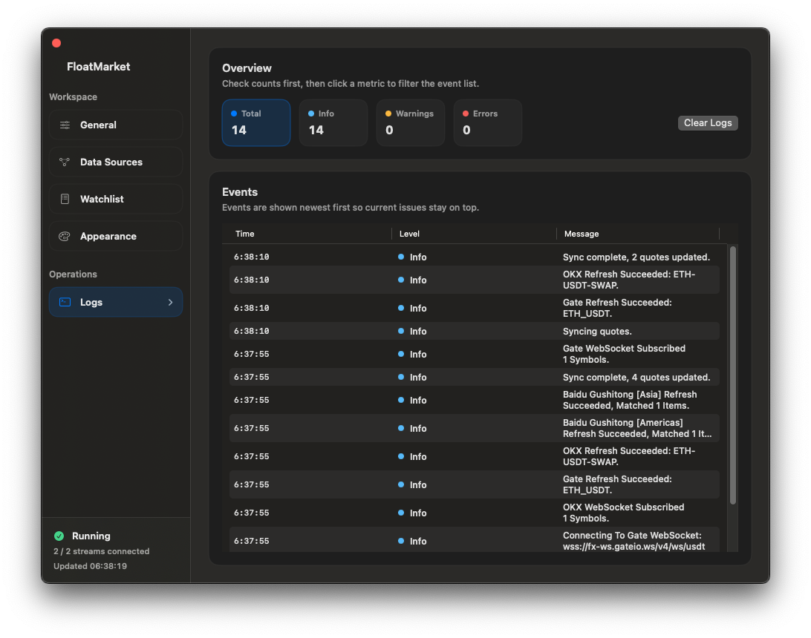

# FloatMarket

[简体中文](./README.zh-Hans.md) | [GitHub Repository](https://github.com/XRSec/FloatMarket) | [Development Guide](./DEVELOPMENT_GUIDE.md) | [Engineering Standards](./ENGINEERING_STANDARDS.md)

FloatMarket is a macOS floating market board built for fast, glanceable monitoring.

It combines global indices, crypto spot pairs, and perpetual contracts in a compact always-on-top window, with a dedicated settings window for layout, theme, data source, and proxy control.

## What The App Does

- Shows a floating window that stays visible for quick market checks.
- Supports a compact mini window and an expanded board view.
- Tracks global indices, crypto spot pairs, and perpetual contracts in one watchlist.
- Opens the related web page on double-click, with editable default quick links.
- Keeps settings, watchlist items, proxy settings, and window appearance in a local JSON file.

## Highlights

- Floating window and mini window with separate font sizing and background opacity.
- Chinese and English UI, with a follow-system language option.
- Light, dark, and follow-system theme modes for the floating window.
- Editable watchlist with built-in templates for common indices and major crypto pairs.
- Proxy support for both HTTP and SOCKS5, with a built-in connectivity test.
- Menu bar app workflow: open settings, show or hide the floating window, and quit quickly.

## Screenshots

<p align="center">
  
  
  
</p>
<p align="center">
  
  
  
</p>

## Supported Market Data

### Global Indices

- `Baidu Gushitong`
- `Sina Finance`

Built-in templates include common instruments such as:

- `IXIC`
- `DJI`
- `SPX`
- `FTSE`
- `DAX`
- `CAC`
- `NK225`
- `HSI`
- `KOSPI`
- `000001`
- `399001`
- `DINIW`
- `USDCNY`
- `USDCNH`

### Crypto

- `OKX`
  - Spot templates: `BTC`, `ETH`, `SOL`, `XRP`, `DOGE`
  - Perpetual templates: `BTC Perpetual`, `ETH Perpetual`, `SOL Perpetual`, `XRP Perpetual`, `DOGE Perpetual`
- `Gate`
  - Spot templates: `BTC`, `ETH`, `SOL`, `XRP`, `DOGE`
  - Perpetual templates: `BTC Perpetual`, `ETH Perpetual`, `SOL Perpetual`, `XRP Perpetual`, `DOGE Perpetual`
- `Binance`
  - Spot templates: `BTC`, `ETH`, `SOL`, `XRP`, `DOGE`
  - Perpetual templates: `BTC Perpetual`, `ETH Perpetual`, `SOL Perpetual`, `XRP Perpetual`, `DOGE Perpetual`

Global indices and snapshot-only feeds use interval-based polling. WebSocket feeds do not use timer-based refreshes, and only trigger a one-off HTTP snapshot sync after disconnects or reconnects.

## User Experience

- The expanded floating board groups quotes by:
  - `Global Indices`
  - `Spot`
  - `Perpetuals`
- The mini window can pin specific items or fall back to the first available quote.
- Global indices support a collapsed or expanded section inside the floating board.
- The settings window provides controls for:
  - theme
  - transparency
  - width
  - maximum floating height
  - mini window display mode
  - data source endpoints
  - watchlist editing
  - proxy testing
- The logs view focuses on:
  - HTTP snapshot recovery after WebSocket disconnects
  - HTTP resync after WebSocket reconnects
  - request failures, fallbacks, and decode errors

## Project Layout

```text
FloatMarket/
├── FloatMarket/
│   ├── About/
│   ├── Commands/
│   ├── Data/
│   ├── MenuBar/
│   ├── Panes/
│   ├── Settings/
│   ├── Sidebar/
│   ├── Utilities/
│   ├── Windowing/
│   ├── MainScene.swift
│   └── MainView.swift
├── docs/
├── dmg-assets/
├── scripts/
├── FloatMarket.xcodeproj
├── Makefile
├── README.md
└── README.zh-Hans.md
```

## Build And Run

Open the project in Xcode:

```bash
open FloatMarket.xcodeproj
```

Build a debug app from the command line:

```bash
make build-debug
```

Launch the debug build:

```bash
make debug
```

Create a release DMG:

```bash
make dmg
```

## Configuration And Persistence

- Settings are saved to:
  - `~/Library/Application Support/FloatMarket/settings.json`
- The app ships with built-in watchlist templates.
- Users can edit or remove any default item after it is added.
- Quick link URLs have defaults, but can be overridden per watch item.

## Customizing The App

### Add A Custom Watch Item

You do not need to start from an empty form unless you want to.

1. Open the settings window from the menu bar or floating window.
2. Go to `Watchlist`.
3. Click `Add` and pick the closest built-in preset.
4. In the detail pane, adjust:
   - `Display Name`
   - `Source`
   - `Symbol / Contract`
   - `Region` for Baidu global indices
   - `Quick Link URL`
5. Keep it enabled if it should appear in the floating window.
6. Optionally pin it in `Mini Window`.
7. Save the settings.

The `Preset` picker in the editor can also be used as a shortcut: choose a template first, then overwrite the fields you want to customize.

### Add A Custom Language

Custom languages are added at the app bundle level, not from the settings UI itself.

Add a new localization folder under:

- `FloatMarket/<language-code>.lproj/`

Minimum recommended files:

- `FloatMarket/<language-code>.lproj/Localizable.strings`
- `FloatMarket/<language-code>.lproj/InfoPlist.strings`

Important requirements:

- Add a `Language Self Name` entry in `Localizable.strings`.
- Keep the language code consistent with Apple localization folder names, for example:
  - `en.lproj`
  - `zh-Hans.lproj`
  - `ja.lproj`
- Rebuild the app after adding the new folder.

Once the new `.lproj` bundle is included, FloatMarket will automatically read it and show the language in the app menu and settings language picker.

Example:

```text
FloatMarket/fr.lproj/
├── InfoPlist.strings
└── Localizable.strings
```

Example `Localizable.strings` header:

```text
"Language Self Name" = "Français";
```

## Developer Notes

If you are working on the app rather than just using it:

- [Development Guide](./DEVELOPMENT_GUIDE.md)
- [Engineering Standards](./ENGINEERING_STANDARDS.md)
- [DMG Assets Notes](../dmg-assets/README.md)

## License

This project is licensed under the [MIT License](../LICENSE).
